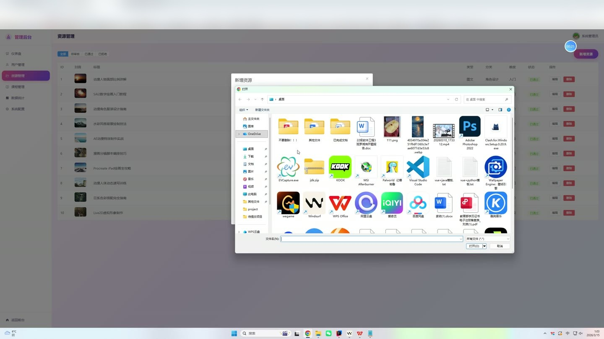
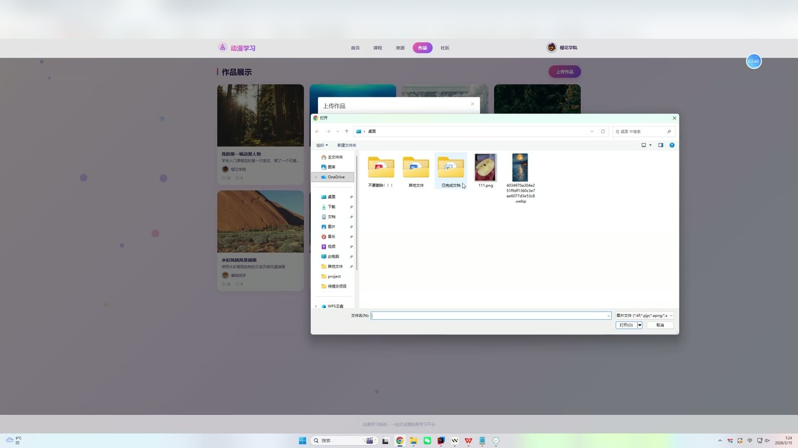

# (附文档)Springboot3+Vue3+MySQL 动漫学习网站

**技术栈**：Springboot3、Vue3、MySQL

### 系统简介

动漫学习网站是一个基于 Spring Boot 3 + Vue 3 前后端分离的在线学习平台，包含管理员端与普通用户端两大角色。系统提供动漫类课程学习、学习资源浏览与下载、社区帖子交流、用户作品展示、个性化推荐等功能，支持用户注册登录、课程报名与进度追踪、资源上传与审核管理、系统配置动态维护等完整业务流程。
 
### 核心功能
 
### 普通用户端

 
- 注册与登录：通过用户名、密码、昵称进行账号注册，注册后自动登录并返回 JWT Token；已注册用户通过用户名密码登录。 
- 个人信息管理：查看个人基本信息（昵称、头像、邮箱、学习偏好），支持修改昵称、邮箱、头像和学习偏好字段。 
- 课程浏览与筛选：按课程等级（level）、分类（categoryId）、关键词（keyword）分页查询课程列表，默认按报名人数降序排列。 
- 课程报名：点击报名按钮加入课程，系统自动记录报名时间并增加课程报名数，同时记录用户行为用于推荐。 
- 课程进度更新：学习课程时提交当前章节 ID 和进度百分比，进度达到 100% 时自动标记为已完成并记录完成时间。 
- 课程评价：对已报名课程提交评分（1-5 分）和文字评价，评价后展示在课程详情页。 
- 我的课程：查看自己已报名的所有课程列表，包含每门课程的报名信息和学习进度。 
- 学习资源浏览与搜索：按资源类型、分类、难度、关键词分页搜索已审核通过的资源，支持按创建时间排序。 
- 资源详情查看：点击资源进入详情页，自动增加浏览次数，展示资源标题、描述、封面、作者信息、分类名称、评论数等。 
- 资源下载：点击下载按钮增加资源下载次数，并记录用户下载行为。 
- 资源上传：用户可上传自己的学习资源，提交时状态自动设为“待审核”（PENDING），需管理员审核后方可公开。 
- 社区帖子浏览：分页查看所有帖子列表，显示帖子标题、内容、作者昵称头像、浏览/评论/点赞数。 
- 帖子详情与互动：点击进入帖子详情自动增加浏览数，可对帖子点赞、查看评论列表。 
- 发布帖子：用户可创建新帖子，填写标题、内容和图片 URL，发布后自动记录作者和初始计数。 
- 用户作品浏览：分页查看所有用户作品列表，显示作品标题、描述、图片、作者信息、点赞/评论数。 
- 作品详情与互动：查看作品详情，可对作品点赞、查看评论列表。 
- 发布作品：用户可创建新作品，填写标题、描述和图片 URL，发布后自动记录作者和初始计数。 
- 我的作品：查看自己发布的所有作品列表。 
- 评论功能：对资源、帖子、作品三种目标类型发表评论，评论后自动更新目标对象的评论计数。 
- 个性化推荐：系统根据用户浏览/下载/报名行为，通过协同过滤算法推荐学习资源和课程；新用户推荐热门内容。 
- 学习画像查看：查看个人学习行为统计（总浏览/下载/报名次数）、偏好分类和偏好难度，以及推荐理由说明。 
- 文件上传：支持上传图片等文件到服务器指定目录，返回可访问的 URL 地址。
 
### 管理员端

 
- 仪表盘统计：查看平台整体数据总览，包括用户总数、已审核资源数、待审核资源数、课程总数、报名总数、完成学习数、帖子数、作品数、行为记录数。 
- 用户管理：分页查看所有用户列表（按注册时间降序），支持修改用户状态（启用/禁用）和删除用户。 
- 资源管理：分页查看所有学习资源列表，支持按审核状态（全部/待审核/已通过/已拒绝）筛选。 
- 资源审核：对待审核资源执行审核操作，可修改资源状态为 APPROVED（通过）或 REJECTED（拒绝）。 
- 资源增删改：管理员可直接新增资源（自动设为已审核通过），也可编辑或删除已有资源。 
- 课程管理：分页查看所有课程列表，支持新增课程（设置标题、描述、封面、等级、分类、讲师、总学时、章节数等），编辑和删除课程。 
- 章节管理：查看指定课程下的所有章节列表（按排序号升序），支持新增、编辑、删除章节（设置标题、内容、视频 URL、排序号、时长）。 
- 系统配置管理：查看所有系统配置项列表，支持修改配置项的值（如站点名称、是否开放注册等）。 
- 文件上传：支持上传图片等文件到服务器指定目录。
 
### 技术栈

 后端框架Spring Boot 3 ORMMyBatis-Plus 权限认证Spring Security + JWT（jjwt） 前端框架Vue 3 状态管理Vue Router（前端路由） 构建工具Maven（后端） 数据库MySQL 8 文件上传MultipartFile 本地存储 日志与异常处理SLF4J + @RestControllerAdvice 全局异常处理
 
### 交付内容

 
- 后端完整源码 
- 前端完整源码 
- 数据库初始化脚本 
- 万字文档

## 界面展示

---

## 获取完整源码 + 万字文档

本仓库为项目介绍页。**完整前后端源码、数据库初始化脚本、万字项目文档**，请加微信 `kangkangcode`，或访问 [codekk.top](http://codekk.top) 获取。

可作课程设计 / 毕业设计参考，支持远程部署调试。